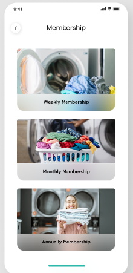

# 🧺 Already Washed

Already Washed is a mobile application developed using Flutter, designed to provide an easy and efficient laundry service. This app covers the complete cycle of laundry services, from creating orders to tracking them, with an easy-to-use interface.

---

## 📋 Table of Contents

- [Overview](#overview)
- [Features](#features)
- [Screens](#screens)
- [Architecture](#architecture)
- [Figma Project Link](#figma-project-link)
- [Installation](#installation)

---

## 📝 Overview

Already Washed aims to make laundry services accessible and straightforward, allowing users to manage their laundry orders efficiently from their mobile devices. The app includes various screens and features for managing orders, tracking status, setting schedules, and accessing subscription packages.

---

## ✨ Features

- 🔐 **User Authentication**: Login, Register, Forgot Password
- 📧 **Email Verification**
- 💳 **Membership and Subscription Management**
- 🚚 **Order Tracking and Status Updates**
- 🔔 **Notifications for Updates**
- 🔒 **Secure Password Reset**
- 📱 **User-friendly Navigation and UI**

---

## 📱 Screens

1. **Onboarding Screen**  
   Display an introduction to the app's features.  
   

2. **Login Screen**  
   Secure login with email and password.  
   

3. **Register Screen**  
   Create a new account.  
   

4. **Forgot Password Screen**  
   Initiate password recovery.  
   

5. **Email Verification Screen**  
   Verify email for secure access.  
   

6. **Set New Password Screen**  
   Securely set a new password.  
   

7. **Home Screen**  
   Main dashboard for navigating features.  
   

8. **Membership Screen**  
   View and manage membership options.  
   

9. **New Order Screen**  
   Place a new laundry order with details, scheduling, and price calculation.  
   

10. **Packages and Subscriptions Screen**  
    Access and subscribe to available packages.  
    

11. **Settings Screen**  
    Adjust app settings.  
    

12. **Contact Us Screen**  
    Reach out for support or inquiries.  
    

13. **Track Order Screen**  
    Track the status of placed orders.  
    

14. **Order Status Screen**  
    Check the real-time status of the current order.  
    

15. **Rating Screen**  
    Rate the service post-completion.  
    

---

## 🏗️ Architecture

The application is built with the **Cubit** state management approach, making the app's state predictable and efficient. Firebase integration powers key functionalities, such as:

- 📂 **Data Management**: Storing user information and order details.
- 🔒 **Email Verification**: Secure account setup with email verification.
- 🔔 **Notifications**: Real-time updates for order status and reminders.

---

## 🔗 Figma Project Link

Explore the complete design prototype on Figma: [Already Washed on Figma](https://www.figma.com/design/6IeOs5jxPnAnAByqLIE3pO/Laundry-App-(7)?node-id=0-1&node-type=canvas&t=vXR1Z4BuK15Usjpn-0)

---

## ⚙️ Installation

1. Clone the repository:

   ```bash
   git clone https://github.com/your-repo/already-washed.git
   ```
   
2. Navigate to the project directory:

   ```bash
   cd already-washed
   ```

3. Install dependencies:

   ```bash
   flutter pub get
   ```
   
4. Run the app::

   ```bash
   flutter run
   ```
